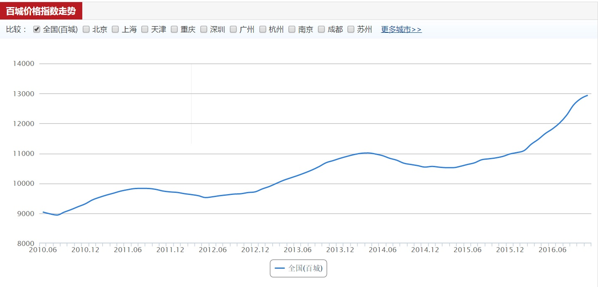

# A-glance-of-world
经济生活无所不在，用心去感受它的脉搏

## 近期的学习计划

## housing

很高兴，能有机会参与到这段疯狂的历史重，能体会关于房子给人们的喜怒哀乐。一言不合，就上图吧:

关注这个数据三年左右，不要问为什么这个指数于2016年底中断了！

* 房天下发布于每月的最后一天发布，或者次月的第一天发布，先于官方数据发布（总是会在这一两天非常积极的去查看它的报告）
* 数据经常与官方数据有一定出入
* 在政府面临着空前压力的情况下，透露甚至夸大市场的疯狂，在政府绞尽脑汁调控市场时，
作为一个第三方的数据，政府不愿意看到它的存在以及不良影响（个人理解）。

后面有空整理下官方数据。
